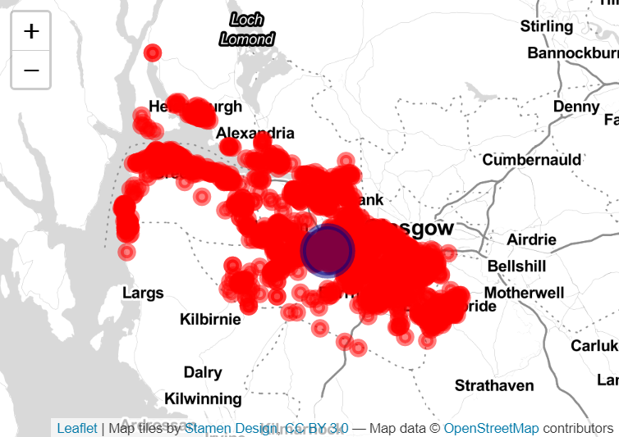
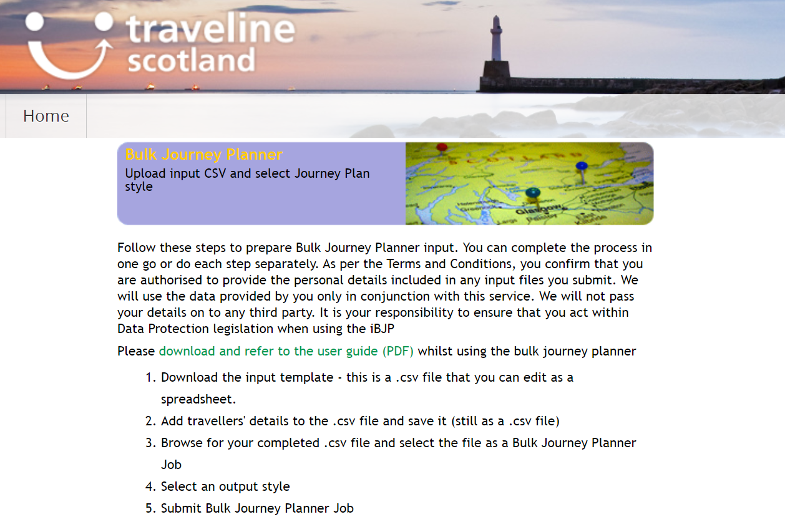
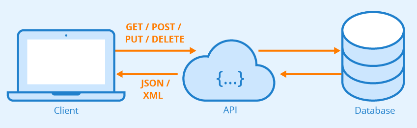
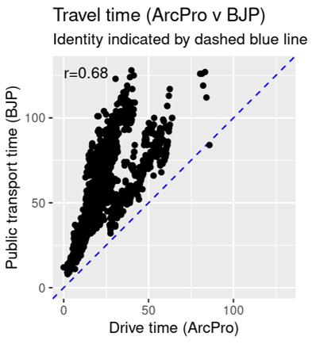

```{r echo=FALSE,include=FALSE}

library( magrittr )
library( stringr )
library( dplyr )
library( PostcodesioR ) ### Postcode information
library( httr )
library( xml2 )
library( lubridate )
library( knitr )
library( leaflet ) ### For drawing maps
library( icon )


knitr::knit_hooks$set(mysize = function(before, options, envir) {
  if (before) 
    return(options$size)
})

load( "dat/postcodes.Rdat" )
```

# Introduction

- Principal Information Analyst at Public Health Scotland
- Clinical trials statistician
- Effect of public transport accessibility on attendance

# The problem
 
 {height=60%}

# Postcode information

```{r mysize=TRUE, size='\\scriptsize'}
POSTCODE.information %>% glimpse
```

# Postcode information

```{r mysize=TRUE, size='\\scriptsize'}
orig = POSTCODE.information %>%
  filter( group=="Participant" ) %>%
  head( 1 ) %>%
  pull( postcode )

orig

dest = POSTCODE.information %>%
  filter( group=="Hospital" ) %>%
  pull( postcode )


dest
```

# Traveline Scotland's Bulk Journey Planner

{height=60%}

#  API access

{height=60%}

- A way to interact with services online

  1. Construct your QUERY
  2. Submit the QUERY to the API
  3. Parse the RESPONSE from the API

- To access the API, you may be issued a KEY


# Bulk Journey Planner API

- Locations need to be described by their 'Eastings' and 'Northings'.

```{r mysize=TRUE, size='\\scriptsize', eval=TRUE}
orig_info = PostcodesioR::postcode_lookup( orig )
orig_info.e = orig_info$eastings %>% as.character()
orig_info.e

orig_info.n = orig_info$northings %>% as.character()
orig_info.n
```

```{r echo=FALSE, include=FALSE, eval=TRUE}
dest_info = PostcodesioR::postcode_lookup( dest )
dest_info.e = dest_info$eastings %>% as.character()
dest_info.n = dest_info$northings %>% as.character()
```

# 1. Construct the QUERY

```{r echo=FALSE, mysize=TRUE, size='\\scriptsize', eval=TRUE}
BASE_QUERY_STRING %>% str_split("\n") %>% unlist %>% head(15) %>% paste( collapse="\n") %>% cat

```

...


# 1. Construct the QUERY

```{r mysize=TRUE, size='\\scriptsize', eval=TRUE}
my_query = BASE_QUERY_STRING %>%
    str_replace( "VALUE_REQUEST_ID"           , sprintf( "%s>%s",
                                                        orig,
                                                        dest)) %>%
    str_replace( "VALUE_ORIGIN_EASTING"       , orig_info.e ) %>% 
    str_replace( "VALUE_ORIGIN_NORTHING"      , orig_info.n ) %>%
    str_replace( "VALUE_DESTINATION_EASTING"  , dest_info.e ) %>% 
    str_replace( "VALUE_DESTINATION_NORTHING" , dest_info.n ) %>%
    str_replace( "VALUE_ARRIVAL_TIME"         , "2020-12-10T13:00:00" )
```

# 1. Construct the QUERY

```{r echo=FALSE, mysize=TRUE, size='\\scriptsize', eval=TRUE}
my_query %>% str_split("\n") %>% unlist %>% head(15) %>% paste( collapse="\n") %>% cat

```

# 2. Submit the QUERY to the API

```{r mysize=TRUE, size='\\scriptsize', eval=TRUE}
post_response = httr::POST( API_URL,
                            httr::add_headers(user_key = API_KEY),
                            body=my_query )

post_response.xml = httr::content( post_response, as = "parsed" )

```

# 3. Parse the RESPONSE from the API

```{r mysize=TRUE, size='\\scriptsize', eval=TRUE}

# xml2::write_xml( x=post_response.xml,
#                  file="journey_output.xml",
#                  as="xml" )

xml2::xml_ns_strip( post_response.xml )
xml_ilist = xml2::xml_find_all( post_response.xml,
                                ".//Itinerary")
n_i = xml_ilist %>% length
n_i

```

# 3. Parse the RESPONSE from the API

```{r echo=FALSE, include=FALSE, eval=TRUE}
journeys = tibble( origin      = orig,
                   destination = dest,
                   start  = NA,
                   end    = NA ) %>% 
  slice( rep.int(1,this.n_itineraries) )

for ( option.i in 1:n_i ) {
  this.itinerary = xml_ilist[[option.i]]
  
  these.departures = xml2::xml_find_all( this.itinerary, xpath=".//ScheduledDepartureTime" )
  these.arrivals   = xml2::xml_find_all( this.itinerary, xpath=".//ScheduledArrivalTime" )
  
  this.start_text = these.departures %>% xml2::xml_text() %>% min
  this.end_text   = these.arrivals   %>% xml2::xml_text() %>% max
  
  this.start = this.start_text %>% lubridate::ymd_hms() 
  this.end   = this.end_text   %>% lubridate::ymd_hms() 

  journeys$start[option.i] = this.start_text
  journeys$end[option.i] = this.end_text
}
```

```{r echo = FALSE, mysize=TRUE, size='\\tiny', eval=TRUE}
knitr::kable( journeys )
```

```{r mysize=TRUE, size='\\scriptsize', eval=TRUE}
journeys = journeys %>% mutate(
  duration = as.numeric(difftime(ymd_hms(end),
                                 ymd_hms(start)),
                        units="hours") ) %>% 
  select( -start, -end )
```

```{r echo = FALSE, mysize=TRUE, size='\\tiny', eval=TRUE}
knitr::kable( journeys )
```

# Comparing to other data sources?

{height=60%}

# Bulk Journey Planner Options

Users can specify:

- modes of transport (bus/rail/walk/metro/ferry)
- how many itineraries
- depart after (rather than arrive by)

Traveline Scotland provide query templates for different queries:

- Fare calculation (where possible)
- Service timetables
- Information about service providers

# Bulk Journey Planner advice

- Don't expect helpful error messages
  - If your arrive by date/time is the past, it will silently fail
  - If you can't arrive by your date/time within a day, it will silently fail
- Don't send big batches
  - If >3 jobs fail, the whole batch fails
- Add a 'Sys.sleep()' between queries

# Thank you

{width=0.35cm} [Lisa.Hopcroft@phs.scot](mailto:lisa.hopcroft@phs.scot)

{width=0.35cm} [\@LisaHopcroft](twitter.com/lisahopcroft)

{width=0.35cm} [LisaHopcroft](github.com/LisaHopcroft) // [TALK-RLadies-Edinburgh-16-Dec-2020](https://github.com/LisaHopcroft/TALK-RLadies-Edinburgh-16-Dec-2020)

